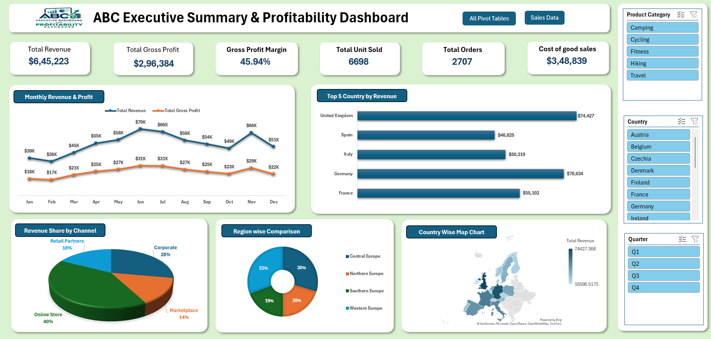

# Excel-Sales-Dashboard-Project
Executive Sales &amp; Profitability Dashboard built in Excel to monitor Revenue, Gross Profit, Gross Margin %, Units Sold, and Sales Records. Features monthly revenue and profit trends, Top 5 Countries by Revenue, channel-wise revenue share, region-wise comparisons, and a country-wise map chart for data-driven decision-making.

## ✨ Features

- **KPI Cards:** Track Revenue, Gross Profit, Gross Margin %, Units Sold, and Sales Records.
- **Monthly Analysis:** Compare monthly revenue and profit trends.
- **Top 5 Countries:** Identify the highest-revenue countries.
- **Channel Analysis:** Visualize revenue share by sales channel.
- **Regional Comparison:** Compare performance across regions.
- **Geographical Map:** Visualize country-wise revenue distribution.
- **Data Visualization:** Present key business insights through charts and visual reports.

## Dashboard Preview

